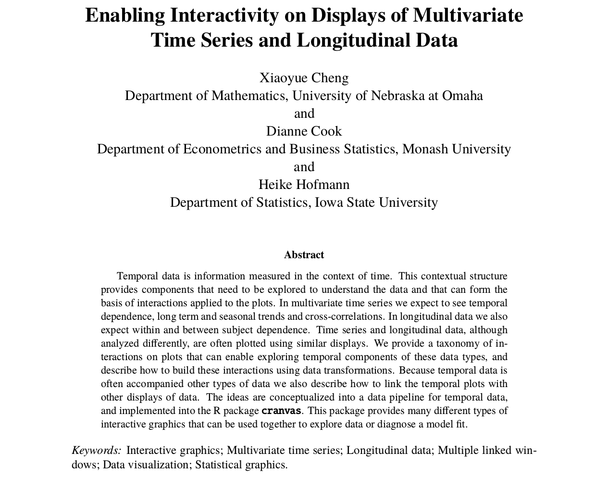
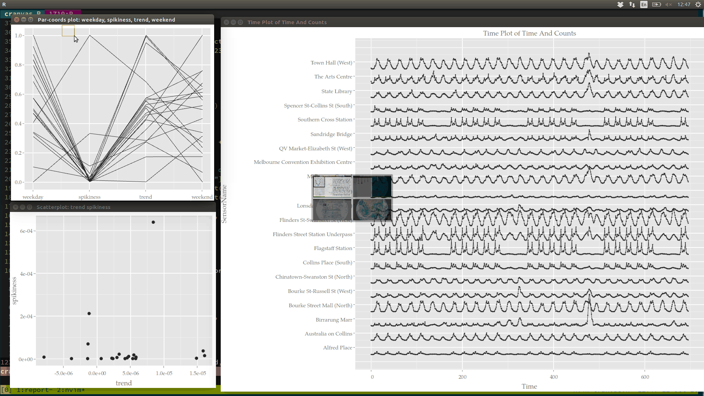
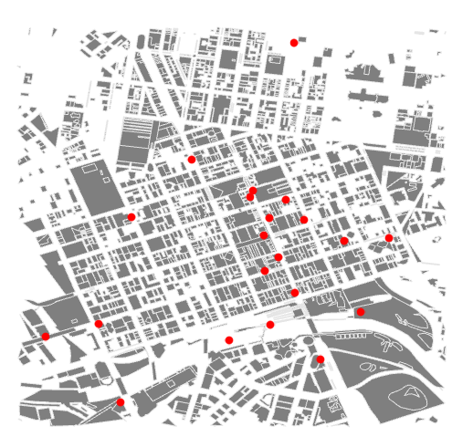

```{r initial, echo = F, cache = F, results = 'hide'}
opts_chunk$set(warning = FALSE, message = FALSE,
			   fig.path = 'figure/', cache.path = 'cache/', 
			   fig.align = 'center', dev = 'png', fig.width = 15, fig.height = 8, 
			   fig.show = 'hold', cache = FALSE, external = TRUE,
         dev = 'CairoPNG')
read_chunk('../scriptsR/interactive.R')
```

# Overview of the paper

<!-- <center></center> -->

<center>
## Enabling Interactivity on Displays of <br> Multivariate Time Series and Longitudinal data
</center>

<center>
Xiaoyue Cheng, Dianne Cook & Heike Hofmann
</center>

## Summary

* Exploring aspects of time series
    + Irregular periods
    + Unusual events
    + Symmetry of peaks and troughs
* Comparing multiple time series
    + Matching locations of peaks and valleys 
* Exploring individuals in longitudinal data
    + Grouping temporal patterns
    + Linking to associated information, e.g. geographic location or age, gender
* Software: `cranvastime`

## Key innovations

* Interactive graphics for temporal data via linear algebra
* Linking between time series plots and other plots

# My example: Melbourne pedestrian sensors 

```{r setup, echo = FALSE, results = 'hide'}
```

```{r leaflet, echo = FALSE, fig.width = 18}
```

# A glimpse at pedestrian traffic (made with plotly)

```{r plotly, echo = FALSE}
```

```{r gg-ts, echo = FALSE, fig.width = 18}
```

# Interactivity %>% let data walk, stretch, and dance

<center>

</center>


# Special interactions for temporal data

+ Wrapping
+ Faceting
+ Mirroring
+ Shifting
+ Switching

**Most movements/interactions can be formulated into linear algebra.**

$$
\mathbf{m}_{ij} = f_{i}(\mathbf{p}_i, \mathbf{u}_{ij}, \mathbf{l}_{ij}, j, 
(\mathbf{x, y})_{0})
$$

# Wrapping: change x/y-coordinates of the data

## How x-wrapping works

  $$
  \mathbf{m}_{ij} = \begin{cases}
  (-\left(\left[\frac{\mathbf{x} - x_{(1)} + 1}{\Delta_{n-j}}\right] - 1\right) 
  \times \Delta_{n-j}, 0) & 1 \le j \le n - 3\\
  (-\left(\left[\frac{\mathbf{x} - x_{(1)} + 1}{\Delta_{3}}\right] - 1\right) 
  \times \Delta_{3}, 0) & j \ge n - 2
  \end{cases}
  $$

  <center>


  </center>

# x-wrapping

## Explore seasonality and temporal dependence 
  <center>

  </center>

# y-wrapping

## Compare magnitude of peaks and troughs 
  <center>

  </center>


# Switching & Mirroring

* Switching: switch between line and area displays
* Mirroring: vertically split series at a specified value and flip the bottom half
  across this axis
  $$
  \mathbf{m}_{ij} = \begin{cases}
  (0, p + \max(p - \mathbf{y}, \mathbf{y} - p) - \mathbf{y}) & j = 1, 3, 5, \cdots \\
  (0, 0) & j = 2, 4, 6, \cdots
  \end{cases}
  $$
      <center>

      </center>

# Faceting & Shifting

* Faceting: create small multiples
  $$
  \mathbf{m}_{ij} = \begin{cases}
  (0, p_{i1}(\mathbf{l}_i - 1)j) & 1 \le j \le \frac{1}{p_{i1}} \\
  (0, \mathbf{l}_i - 1) & j \ge \frac{1}{p_{i1}}
  \end{cases}
  $$
* Shifting: select and shift a series against another series
  $$
  \mathbf{m}_{ij} = ((u_{ij2} - u_{ij1}) \times I\left\{\mathbf{l}_{ij} = u_{ij3}
  \right\}, 0)
  $$
      <center>

      </center>

<!-- ## Manage data or movements? -->
<!--  -->
<!-- * Incremental  -->
<!--   $$ -->
<!--   (\mathbf{x, y})_{s_{t + 1}} = (\mathbf{x, y})_{s_{t}} + \mathbf{m}_{i1} -->
<!--   $$ -->
<!-- * Baseline  -->
<!--   $$ -->
<!--   (\mathbf{x, y})_{s_{t + 1}} = (\mathbf{x, y})_{s_{0}} + \sum_{i, j}\mathbf{m}_{ij} -->
  <!-- $$ -->

# Linking %>% let data interact

> Linking between plots builds a reactive brushing chain that when the data points
on one plot are brushed, then they are highlighted on all the plots.

## A rich story beyond the context of time ......

* Multiple time series plot
* Parallel coordinate plot
    + Compute cognostics for every series
        - Strength of trend
        - Strength of weekday and weekend
        - Degree of spikiness
* Scatter plot
    + Strength of trend VS degree of spikiness

<!-- <center> -->
<!--  -->
<!-- </center> -->


# Wrap-up

## What do I learn from the paper?

* Use linear algebra to make time series plots interactive 
* Linking between time series plots and other plots is done using categorical key

## What do I learn from the data?

* Different sensors exhibit different pedestrian traffic patterns.
* The locations of sensors are not ideal for the study of pedestrian flow.

<center>

</center>
